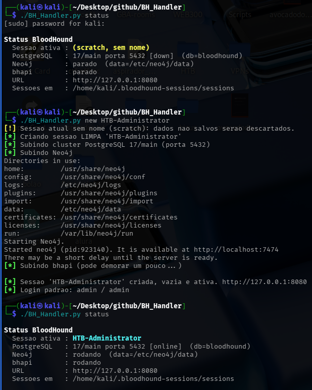
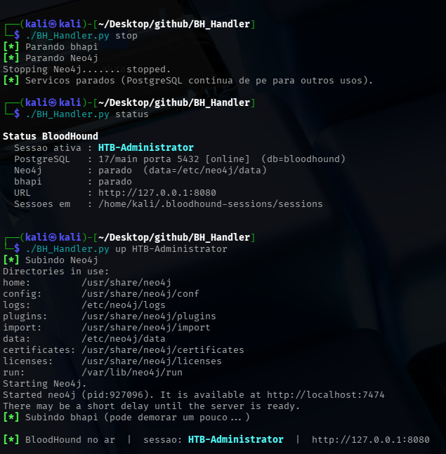
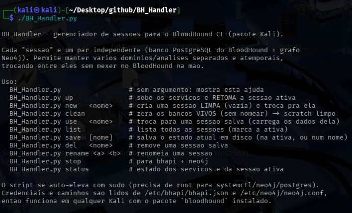

<p align="center">
  
</p>

<h1 align="center">BH_Handler</h1>

<p align="center">
  <strong>Gerenciador de sessões para o BloodHound CE no Kali.</strong><br>
  Mantém vários domínios/engajamentos separados e atemporais — cada sessão é um par
  independente (banco PostgreSQL + grafo Neo4j) — e troca entre eles com um comando.
</p>

<p align="center">
  <em>Feito por <strong>Avocado</strong> · equipe <strong>Caramelo Storm</strong></em><br>
  <a href="https://www.linkedin.com/in/rafael-raugi/">💼 LinkedIn</a> ·
  <a href="https://www.youtube.com/@avocado-shell">📺 YouTube @avocado-shell</a>
</p>

---

O BloodHound CE do pacote Kali usa **um único** banco PostgreSQL + Neo4j. Ao analisar
um novo domínio você precisa **limpar tudo** e perde o anterior. O `BH_Handler` resolve
isso: cada **sessão** vira um snapshot independente (dump do PostgreSQL + tarball do
diretório de dados do Neo4j) guardado em disco. Você cria, salva, troca e retoma
engajamentos **sem mexer no BloodHound na mão** — sai de "um domínio por vez" para
"quantos engajamentos quiser, lado a lado".

> 🔒 **Privacidade:** os snapshots ficam em `~/.bloodhound-sessions/` do seu usuário
> e contêm dados coletados do cliente (usuários, grupos, ACLs do AD). **Não versione
> sessões reais** — o `.gitignore` já cobre isso. Use em máquina/rede isolada e
> expurgue (`del`) o que não precisar mais.

## O que ele faz

- **Sessões nomeadas** — cada engajamento/domínio num par PostgreSQL + Neo4j próprio.
- **Snapshot consistente** — para os serviços, faz `pg_dump -Fc` + `tar` do data dir
  do Neo4j, e devolve a posse dos arquivos ao seu usuário.
- **Troca atômica** — `use <nome>` restaura os dois bancos e religa o BloodHound.
- **Scratch** — um modo "sem nome" para análises rápidas e descartáveis.
- **Zero hardcode** — lê credenciais e caminhos reais de `/etc/bhapi/bhapi.json` e
  `/etc/neo4j/neo4j.conf`, então funciona em qualquer Kali com o pacote `bloodhound`.
- **Auto-eleva com sudo** — precisa de root para `systemctl`/Neo4j/PostgreSQL.

## Como rodar

```bash
cd BH_Handler
./BH_Handler.py up              # sobe os serviços e RETOMA a sessão ativa
./BH_Handler.py new acme        # cria uma sessão LIMPA "acme" e troca pra ela
./BH_Handler.py list            # lista todas as sessões (marca a ativa)
./BH_Handler.py use cliente-x   # troca para uma sessão salva (carrega os dados)
./BH_Handler.py save            # checkpoint da sessão ativa
./BH_Handler.py status          # estado dos serviços e da sessão ativa
```
O script se auto-eleva com `sudo` quando necessário; abra `http://127.0.0.1:8080`.
Login padrão do BloodHound CE: `admin / admin`.

<p align="center">
  
  <br><sub>Subindo os serviços e checando o <code>status</code> da sessão ativa.</sub>
</p>

<p align="center">
  
  <br><sub>Ciclo <code>stop</code> → <code>status</code> → <code>up</code>: os serviços param (PostgreSQL
  segue de pé) e o <code>up</code> religa Neo4j + bhapi <strong>retomando a sessão</strong>.</sub>
</p>

## Comandos

<p align="center">
  
  <br><sub>Ajuda do BH_Handler (<code>./BH_Handler.py</code> sem argumentos ou <code>help</code>).</sub>
</p>


| Comando | Ação |
|---------|------|
| `up` (`start`) | Sobe os serviços e retoma a sessão ativa |
| `new <nome> [desc]` | Cria uma sessão **limpa** (vazia) e troca pra ela |
| `clean` (`reset`, `fresh`) | Zera os bancos vivos → scratch limpo (sem nome) |
| `use <nome>` (`switch`) | Troca para uma sessão salva (restaura os dados dela) |
| `list` (`ls`) | Lista todas as sessões (`*` = ativa) com tamanho e descrição |
| `save [nome]` | Salva o estado atual (na ativa, ou criando/usando `<nome>`) |
| `del <nome>` (`rm`) | Remove uma sessão salva |
| `rename <a> <b>` (`mv`) | Renomeia uma sessão |
| `stop` (`down`) | Para o bhapi + Neo4j (PostgreSQL segue de pé) |
| `status` (`st`) | Estado dos serviços e da sessão ativa |
| `help` | Ajuda |

## Requisitos

- **Kali Linux** com o pacote oficial: `sudo apt install bloodhound`
- Binários esperados no `PATH`: `neo4j`, `pg_lsclusters`, `psql`, `runuser`
  (o script valida e avisa se faltar algo)
- Python 3 (stdlib apenas — **sem dependências externas**)

## Como funciona (resumo técnico)

1. **Config real, não hardcode** — lê `bhapi.json` (db/usuário/segredo) e `neo4j.conf`
   (data dir) da própria máquina; os defaults no topo do script são só fallback.
2. **Salvar** — para `bhapi`+Neo4j, `pg_dump -Fc` do banco e `tar czf` do data dir do
   Neo4j em `~/.bloodhound-sessions/sessions/<nome>/`, com `meta.json`.
3. **Restaurar** — dropa/recria o banco e faz `pg_restore --no-owner`, extrai o tarball
   do Neo4j (preservando dono) e religa os serviços.
4. **Limpar** — recria o banco vazio e remove só o grafo `neo4j`, **preservando** o db
   `system` do Neo4j (mantém a autenticação) — o `bhapi` re-migra o schema no boot.

## Estrutura
```
BH_Handler.py     o gerenciador (Python 3, stdlib, auto-sudo)
caramelo.jpeg     logo da equipe
~/.bloodhound-sessions/        (criado em runtime; NÃO versionado)
  ├── active                   nome da sessão ativa
  ├── sessions/<nome>/         pg.dump + neo4j_data.tar.gz + meta.json
  └── logs/bhapi.log
```

## Aviso

Ferramenta de apoio a **operações ofensivas autorizadas**. O BloodHound e os dados
que ele coleta (estrutura do Active Directory do cliente) só devem ser usados dentro
do escopo de uma **autorização por escrito**. Você é responsável pelo uso.

## Licença

[MIT](LICENSE) — uso autorizado apenas em assessments com autorização por escrito.

---

<p align="center">
  <sub>⚡ <strong>Caramelo Storm</strong> ·
  <a href="https://www.linkedin.com/in/rafael-raugi/">LinkedIn</a> ·
  <a href="https://www.youtube.com/@avocado-shell">YouTube @avocado-shell</a></sub>
</p>
